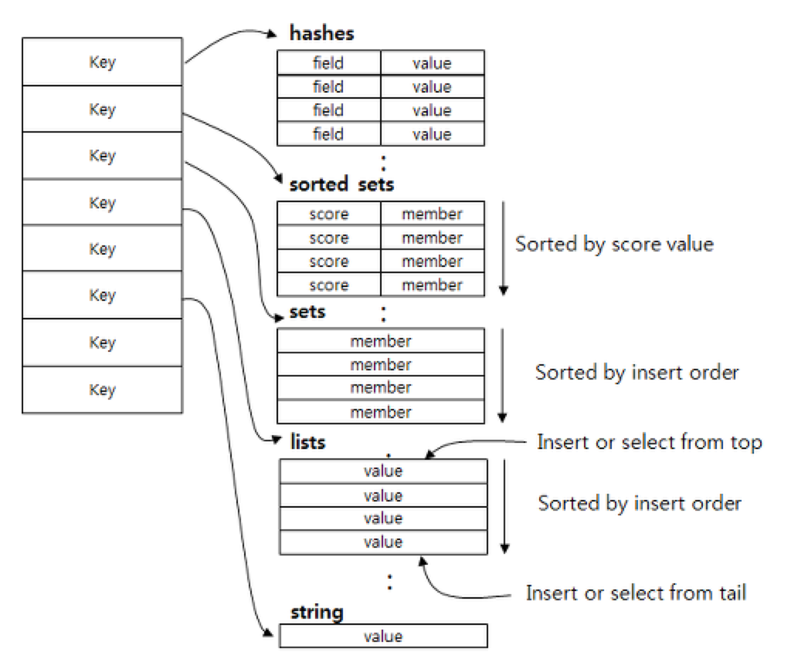

# 레디스 자료구조
> [레디스 튜토리얼 TOAST](https://meetup.toast.com/posts/224)

## string

레디스의 string은 키와 연결할 수 있는 가장 간단한 유형의 값입니다. 레디스의 키가 문자열이므로 이 구조는 문자열을 다른 문자열에 매핑하는 것이라고 볼 수 있습니다.

string 타입에는 모든 종류의 문자열(이진 데이터 포함) 을 저장할 수 있습니다.

따라서 JPEG 이미지를 저장하거나, HTML fragment 를 캐시하는용도로 자주 사용합니다.

## list

레디스의 list는 일반적인 linked list 의 특징을 갖고 있습니다. 따라서 list 내에 수백만 개의 아이템이 있더라도 head와 tail에 값을 추가할 때 동일한 시간이 소요됩니다. 

1. 타임라인 캐시
트위터에서는 각 유저의 타임라인에 트윗을 보여주기 위해 레디스의 list를 사용합니다. 여기서 `RPUSHX`를 사용해서 기존에 캐시된(이미 키가 존재하는, 이미 해당 이름으로 `list`가 존재하는) 경우에만 `RPUSH`를 진행하기 때문에, 캐시된 타임라인에 대해서만 데이터를 추가할 수 있습니다.

2. PUB-SUB 블로킹
또한 일시적으로 list를 blocking하는 기능도 유용하게 사용될 수 있습니다. Pub-Sub 상황에서 list가 비어있을 때 pop을 시도하면 대개 NULL을 반환합니다. 이 경우 소비자는 일정시간을 기다린 후 다시 pop을 시도합니다(= polling). **레디스의 `BRPOP`을 사용하면 새로운 아이템이 리스트에 추가될 때에만 응답하므로 불필요한 polling 프로세스를 줄일 수 있습니다.**

- 이 경우, BRPOP

