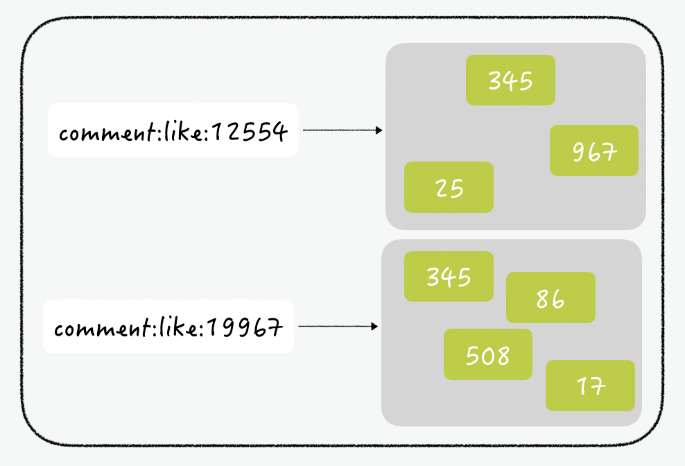

# 레디스 활용 사례
> [TOAST 튜토리얼2](https://meetup.toast.com/posts/225)


## 활용 사례 1
> 좋아요👍🏻 처리하기


게시물에 달린 댓글에 좋아요를 표현하는 기능을 redis로 쉽게 구현할 수 있다.

여기서 가장 중요한 것은 **한 사용자가 하나의 댓글에 한번만 `좋아요`를 하도록 제한해야 한다는 것이다.**




```sql
select articles.id, articles.title, count(article_lies.id) as likes, group_concat(user)
```
## 활용 사례 2
> 게임 서비스🕹에서 일일 순 방문자수(Unique Visitor) 구하기

중복 방문을 제거한 방문자의 지표

실제 서비스에서는 이를 구하기 위해서 대표적으로 세 가지 방법을 사용합니다. 첫 번째로 액세스 로그(access log)를 분석하는 방법, 두 번째로 외부 서비스(ex. Google Analytics)의 도움을 받는 방법, 세 번째로는 접속 정보를 로그 파일로 작성하여 배치 프로그램으로 돌리는 방법입니다. 이 중 구글 Analytics를 제외하고는 실시간 조회가 불가능합니다.

이제 레디스의 비트 연산을 활용하여 간단하게 실시간 순 방문자를 저장하고 조회하는 방법을 알아보겠습니다. 게임의 유저는 천만 명이라 가정하고, 일일 방문자 횟수를 집계하며 이 값은 0시를 기준으로 초기화됩니다.

사용자 ID는 0부터 순차적으로 증가된다고 가정하고, string의 각 bit를 하나의 사용자로 생각할 수 있습니다. 사용자가 서비스에 방문할 때 사용자 ID에 해당하는 bit를 1로 설정합니다. 1개의 bit가 1명을 의미하므로, 천만 명의 유저는 천만 개의 bit로 표현할 수 있고, 이는 곧 1.2MB정도의 크기입니다. 레디스 string의 최대 길이는 512MB이므로 천만 명의 사용자를 나타내는 건 충분합니다.

## 활용 사례 3
> 최근 검색 목록🔎 표시하기

`select * from KEYWORD where ID = 123 order by reg_date desc limit 5;`

이 쿼리는 사용자가 최근에 검색했던 테이블에서 최근 5개의 데이터를 조회합니다. 하지만 이렇게 RDBMS의 테이블을 이용해서 데이터를 저장한다면 중복 제거도 해야 하고, 멤버별로 저장된 데이터의 개수를 확인하고, 오래된 검색어는 삭제하는 작업까지 이루어져야 합니다.

따라서 애초에 중복을 허용하지 않고, 정렬되어 저장되는 레디스의 sorted set을 사용하면 간단하게 구현할 수 있습니다. sorted set은 가중치를 기준으로 오름차순으로 정렬되기 때문에, 가중치로 시간을 사용한다면 이 값이 가장 큰, 나중에 입력된 아이템이 맨 마지막 인덱스에 저장됩니다.

데이터에 멤버를 추가한 뒤, 항상 -6번째 아이템을 지운다면 특정 개수 이상의 데이터가 저장되는 것을 방지 할 수 있게 됩니다. 인덱스로 아이템을 지우려면 ZREMRANGEBYRANK 커맨드를 사용하면 간단합니다. 이렇게 레디스의 sorted set을 이용하면 많은 공수를 들이지 않고도 최근 검색한 담당자를 보여줄 수 있는 기능을 구현할 수 있게 됩니다.

[3](https://medium.com/garimoo/%EA%B0%9C%EB%B0%9C%EC%9E%90%EB%A5%BC-%EC%9C%84%ED%95%9C-%EB%A0%88%EB%94%94%EC%8A%A4-%ED%8A%9C%ED%86%A0%EB%A6%AC%EC%96%BC-03-1d5fa7ca9682)

[4](https://medium.com/garimoo/%EA%B0%9C%EB%B0%9C%EC%9E%90%EB%A5%BC-%EC%9C%84%ED%95%9C-%EB%A0%88%EB%94%94%EC%8A%A4-%ED%8A%9C%ED%86%A0%EB%A6%AC%EC%96%BC-04-17256c55493d)