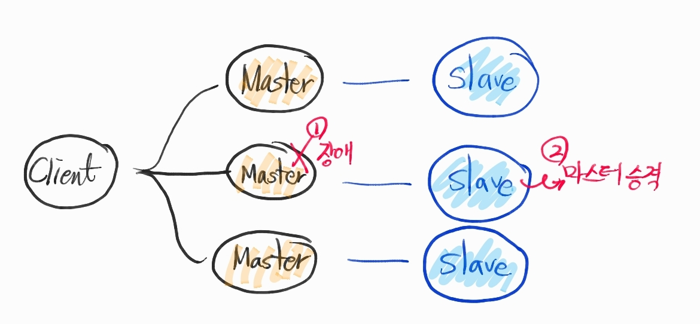

# Redis와 캐시
> [Redis 기본 정리](https://brunch.co.kr/@jehovah/20)

Redis는 key-value 기반으로 다양한 collections를 제공해주는 in-memory data store입니다. 키-값 기반이기 때문에 따로 쿼리를 해줄 필요 없이 바로 결과를 가져올 수 있으며, 인메모리 DB이기 때문에 속도가 매우 빠릅니다.

이러한 인메모리는 속도의 장점을 가질 수 있지만, 휘발성이라는 특징과 상대적으로 작은 사이즈를 가질 수 밖에 없는 한계가 존재합니다. 이로 인한 다양한 주의사항과 관리방법이 있습니다.

다음으로 Redis의 주요한 구조적 특징과 장/단점을 설명드리겠습니다.

## Single Thread
- 장점
  - 트랜잭션 보장
- 단점
  - MTU보다 크면 쪼개진 Packet을 합치며, 합치는 과정이 완료되면 명령을 실행
  - 타임아웃으로 인한 실패 조심

Redis의 대표적인 특징은 Single threaded라는 점입니다. 다시 말해 Redis는 한 번에 딱 하나의 명령어만 실행할 수 있다는 뜻입니다. 만약 명령어를 포함한 Packet이 MTU(Maximum Trasmission Unit)보다 크면 Packet이 쪼개져서 올 수 있는데, Redis는 쪼개진 명령어를 합쳐서 하나의 명령어가 되는 순간 그 명령어를 실행합니다. Single Thread라서 느리다고 생각할 수도 있지만, 평균적으로 Get/Set 명령어같은 경우 초당 10만개 정도까지도 처리할 수 있다고 합니다. 다만 조심할 점은 처리시간이 긴 명령어를 중간에 넣으면 그 뒤에 있는 명령어들은 전부 기다려야 한다는 것입니다. 대표적으로 전체 키를 불러오는 Keys 명령어가 처리가 상당히 오래걸리는데, 만약 중간에 Keys 명령어를 실행하면 그 뒤에 오는 Get/Set 명령어들은 타임아웃이 나서 요청에 실패할 수도 있습니다.

## In-Memory
- 장점
  - 빠른 반응 속도
- 단점
  - 메모리 한계 -> `maxmemory-policy` 관리 (cahce 정책)

Redis를 사용하여 서비스를 운영하다보면 Redis 서버의 메모리가 한계에 도달할 수 있습니다. 메모리의 한계는 maxmemory 값으로 설정할 수 있습니다. maxmemory 수치까지 메모리가 다 차는 경우 Redis는max memory policy에 따라서 추가 메모리를 확보합니다.

| maxmemory-policy 설정값
1. noeviction : 기존 데이터를 삭제하지 않습니다. 메모리가 꽉 찬 경우에는 OOM(Out Of Memory) 오류 반환하고 새로운 데이터는 버리게 됩니다.
2. allkeys-lru : LRU(Least Recently Used)라는 페이지 교체 알고리즘을 통해 데이터를 삭제하여 공간을 확보합니다.
3. volatile-lru : expire set을 가진 것 중 LRU로 삭제하여 메모리 공간을 확보합니다.
4. allkeys-random : 랜덤으로 데이터를 삭제하여 공간을 확보합니다.
5. volatile-random : expire set을 가진 것 중 랜덤으로 데이터를 삭제하여 공간을 확보합니다.
6. volatile-ttl : expire set을 가진 것 중 TTL(Time To Live) 값이 짧은 것부터 삭제합니다.
7. allkeys-lfu : 가장 적게 액세스한 키를 제거하여 공간을 확보합니다.
7. volatile-lfu : expire set을 가진 것 중 가장 적게 액세스한 키부터 제거하여 공간을 확보합니다.

Maxmemory 초과로 인해서 데이터가 지워지게 되는 것을 `eviction`이라고 합니다. Redis에 들어가서 INFO 명령어를 친 후 evicted_keys 수치를 보면 eviction이 발생했는지 알 수 있습니다. Amazon Elasticache를 사용하는 경우에는 monitoring tab에 들어가면 eviction에 대한 그래프가 있는데, 이를 통해 Eviction 여부에 대한 알람을 받을 수도 있습니다.

## COW
> Copy-On-Write

그런데, Maxmemory가 설정된 대로 작동하면 좋겠지만, 그렇지 않은 경우가 있습니다. Redis는 쓰기 요청이 발생하면 COW(Copy On Write) 방식을 통해 작동합니다. 쓰기 요청이 오면 OS는 fork()를 통해서 자식 프로세스를 생성합니다. fork() 시에는 다른 가상 메모리 주소를 할당받지만 물리 메모리 블록을 공유합니다. 쓰기 작업을 시작하는 순간에는 수정할 메모리 페이지를 복사한 후에 쓰기 작업을 진행합니다. 즉, 기존에 쓰던 메모리보다 추가적인 메모리가 필요합니다. 다만 전체 페이지 중에서 얼마나 작업이 진행될지를 모르기 때문에 fork시에는 기본적으로 복사할 사이즈만큼의 free memory가 필요합니다.

Redis를 직접 설치할 때 "/proc/sys/vm/overcommit_memory" 값을 1로 설정하지 않아 장애가 날 때가 있습니다. overcommit_memory=0 이면 OS는 주어진 메모리량보다 크게 할당할 수가 없습니다. 즉, fork()시에 OS가 충분한 메모리가 없다고 판단하기 때문에 에러를 발생시킵니다. overcommit_memory=1 로 설정해서 OS한테 일단 over해서 메모리를 할당할 수 있도록 한 후에 max memory에 도달한 경우 policy에 따라 처리되도록 설정하는 것이 좋습니다.

## Fragmentation(RSS)
> Fragmentation
redis에서는 memory 수치 중에서 used_memory_rss 값을 잘 살펴볼 필요가 있습니다.  RSS 값은 데이터를 포함해서 실제로 redis가 사용하고 있는 메모리인데, 이 값은 실제로 사용하고 있는 used_memory 값보다 클 수 있습니다. 이러한 현상이 발생하는 이유는 OS가 메모리를 할당할 때 page 사이즈의 배수만큼 할당하기 때문입니다. 예를 들어서 page size = 4096 인데, 요청 메모리 사이즈가 10이라고 하면 OS는 4096만큼을 할당합니다. 이를 Fragmentation(파편화) 현상이라고 하는데, 이것이 실제 사용한 메모리랑 할당된 메모리가 다른 원인이 됩니다.

## Replication

Redis를 구성하는 방법 중에서 

1. `Read 분산`
2. 데이터 이중화를 위한 `Master/Slave 구조`가 있습니다.

Master 노드는 쓰기/읽기를 전부 수행하고, Slave는 읽기만 가능합니다. 이렇게 하려면 Slave는 Master 의 데이터를 전부 가지고 있어야 합니다. 이럴 때 발생하는 것이 Replication입니다.

Replication은 마스터에 있는 데이터를 복제해서 Slave로 옮기는 작업입니다. Slave가 싱크를 받는 작업은 다음과 같습니다.

| Master-Slave 간 Replication 작업 순서
1. Slave Configuration 쪽에 "replicaof <master IP> <master PORT>"설정을 하거
나 REPLICAOF 명령어를 통해 마스터에 데이터 Sync를 요청합니다.
2. Master는 백그라운드에서 RDB파일(현재 메모리 상태를 담은 파일) 생성을 위한 프로세스를 진행합니다. 이 때 Master는 fork를 통해 메모리를 복사합니다. 이후에 fork한 프로세스에서 현재 메모리 정보를 디스크에 덤프뜨는 작업을 진행합니다.
3. 2번 작업과 동시에 Master는 이후부터 들어오는 쓰기 명령들을 Buffer에 저장해 놓습니다.
4. 덤프작업이 완료되면 Master는 Slave에 해당 RDB 파일을 전달해주고, Slave는 디스크에 저장한 후에 메모리로 로드합니다.
5. 3번에서 모아두었던 쓰기 명령들을 전부 slave로 보내줍니다.

눈치채신 분들은 아시겠지만, Master가 fork하는 부분에서 자신이 쓰고 있는 메모리만큼 추가로 필요해집니다. 따라서 Replication을 할 때 OOM이 발생하지 않도록 주의하는 것이 중요합니다. 성공적으로 replication을 마쳤다고 하더라도 개선할 점은 아직 남아 있습니다. 바로 Master 노드가 죽게 되는 시나리오입니다.

Master가 죽은 경우에는 Slave는 마스터를 잃어버리고 Sync 에러를 냅니다. 이 상태에서는 쓰기는 불가능하고 읽기만 가능합니다. 따라서 Slave를 Master로 승격시켜야 합니다. 이런 작업을 매번 장애마다 할 수는 없기 때문에 다양한 방법을 통해서 failover에 대응할 수 있습니다. 하나 예시를 들면, DNS기반으로 failover에 대응할 수 있습니다. client는 master 도메인을 계속 바라보게 한 후에, 만약 마스터에 장애가 발생하면 Master DNS를 slave에 매핑합니다. 그러면 client는 특별한 작업 없이도 slave쪽으로 붙게 됩니다.

## Redis Cluster

Redis Cluster는 failover를 위한 대표적인 구성방식 중 하나입니다. Redis Cluster는 여러 노드가 Hash 기반의 Slot을 나눠가지면서 클러스터를 구성하여 사용하는 방식입니다. 전체 slot은 16384이며 hash 알고리즘은 CRC16을 사용합니다. Key를 CRC16으로 해시한 후에 이를 16384로 나누면 해당 key가 저장될 slot이 결정됩니다.

Cluster를 구성하는 각 노드들은 master 노드로, 자신만의 특정 slot range를 갖습니다. 다만 데이터를 이중화하기 위해서 위에서 설명한 slave 노드를 가질 수 있습니다. 즉, 하나의 클러스터는 여러 master 노드로 구성할 수 있고, 한 master 노드가 여러 slave를 가지는 구조입니다. 만약 특정 master 노드가 죽게 되면, 해당 노드의 slave 중 하나가 master로 승격하여 역할을 수행하게 됩니다.