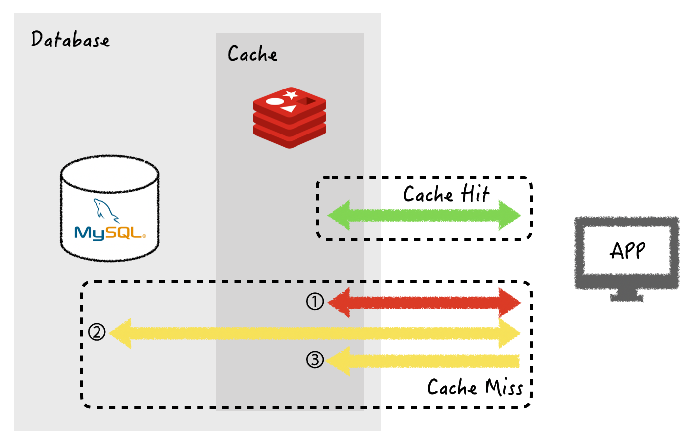
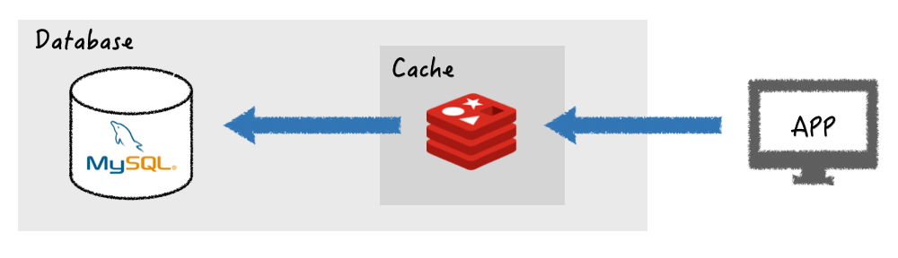

# 레디스와 캐시 2
> [TOAST 튜토리얼2](https://meetup.toast.com/posts/225)

레디스의 2가지 캐싱 패턴에 대해 설명드리겠습니다.

## Look Aside
> = Lazy Loading

Update When Cache hit occured

- 장점
  - 레디스의 장애가 어플리케이션에 치명적인 영향을 주지 않는다.
- 단점
  - 캐시값이 최신임을 보장하지 못한다.
  - cache miss일 경우 데이터 쿼리에 더 오랜 시간이 걸린다.

## Write Through

데이터베이스에 데이터를 작성할 때마다 캐시에 데이터를 추가하거나 업데이트하는 방식

아마도 인메모리의 속도적인 장점을 가지기 위해서 사용한다고 판단됩니다.

- 장점
  - 캐시의 데이터는 항상 최신 상태를 유지
- 단점
  - 데이터 입력 시 두번의 과정을 거치기 때문에 지연시간 증가, 오버헤드, 리소스 낭비

`TTL`을 사용해 사용되지 않는 데이터를 삭제하길 권장합니다.

